# CI/CD Pipeline Flow Diagram

## Complete Deployment Flow

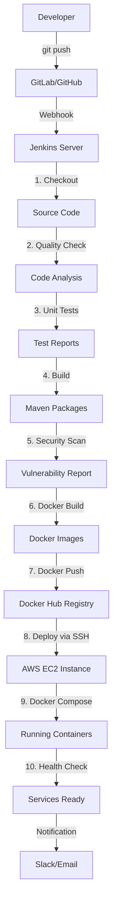

## Jenkins Pipeline Stages

```mermaid
graph LR
    A[Checkout] --> B[Quality Check]
    B --> C[Unit Tests]
    C --> D[Build Services]
    D --> E[Security Scan]
    E --> F[Docker Build]
    F --> G[Docker Push]
    G --> H[Deploy to EC2]
    H --> I[Post Actions]
    
    style A fill:#e1f5ff
    style B fill:#fff4e1
    style C fill:#fff4e1
    style D fill:#e1ffe1
    style E fill:#fff4e1
    style F fill:#ffe1f5
    style G fill:#ffe1f5
    style H fill:#e1e1ff
    style I fill:#f5e1ff
```

## Parallel Execution

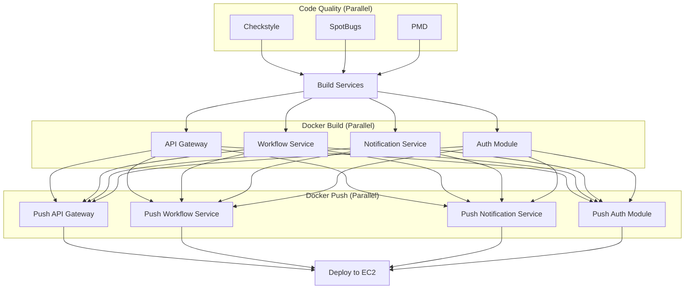

## EC2 Deployment Architecture

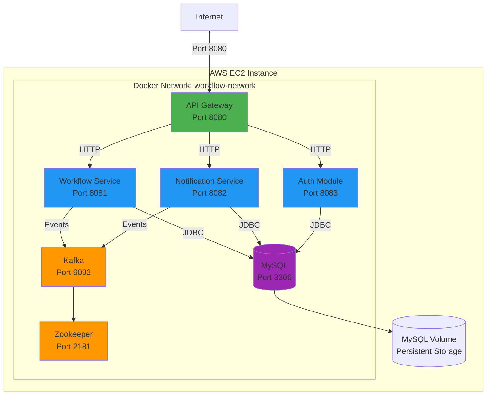

## Service Dependencies

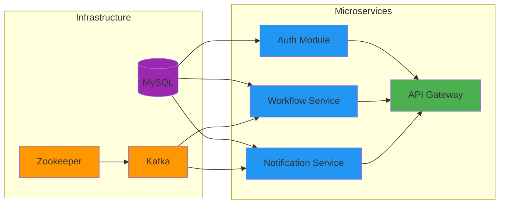

## Deployment Timeline

```mermaid
gantt
    title CI/CD Pipeline Timeline
    dateFormat X
    axisFormat %s
    
    section Build & Test
    Checkout           :0, 10
    Quality Checks     :10, 60
    Unit Tests         :10, 90
    Maven Build        :100, 120
    Security Scan      :220, 30
    
    section Docker
    Build Images       :230, 120
    Push to Registry   :350, 60
    
    section Deploy
    Upload to EC2      :410, 20
    Start Containers   :430, 60
    Health Checks      :490, 30
    
    section Notify
    Send Notifications :520, 10
```

## Branch Strategy

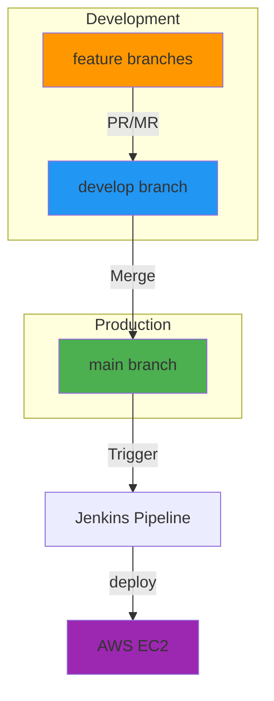

## Failure Handling & Rollback

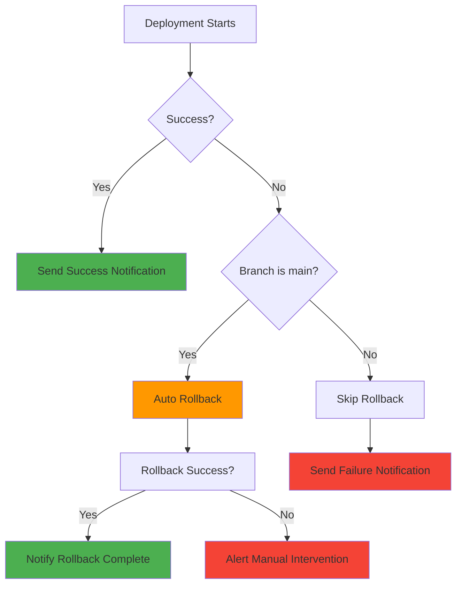

## Data Flow

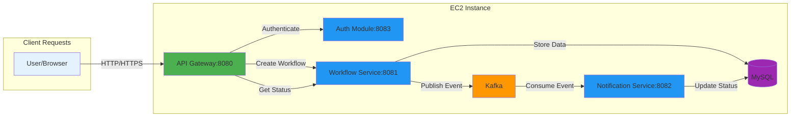

## Security Layers

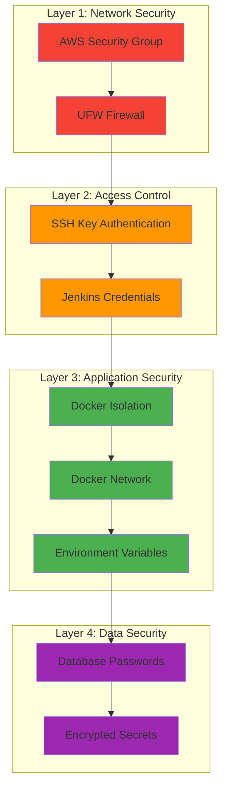

## Monitoring & Observability

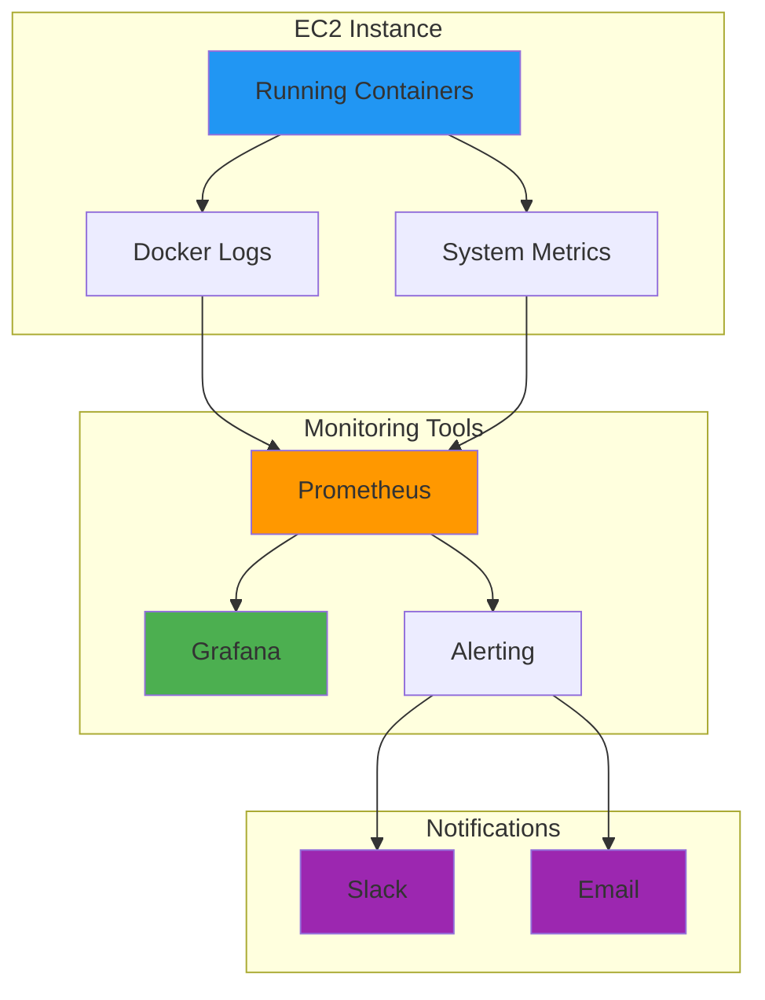

## Resource Utilization

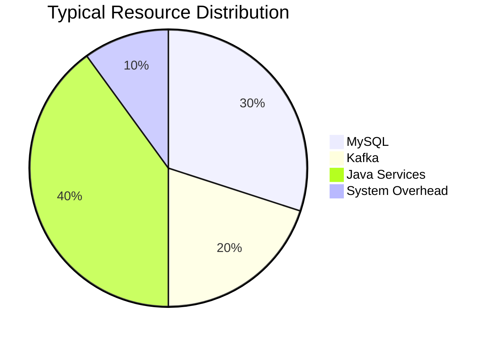

## Cost Optimization

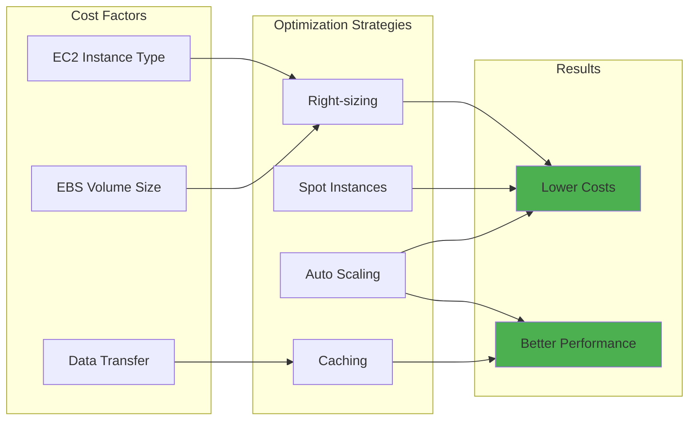

---

**Note:** These diagrams provide visual representations of the CI/CD pipeline and deployment architecture. Refer to the detailed documentation for implementation specifics.
